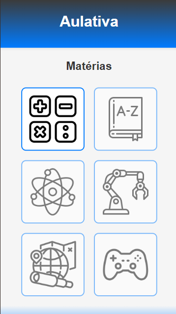
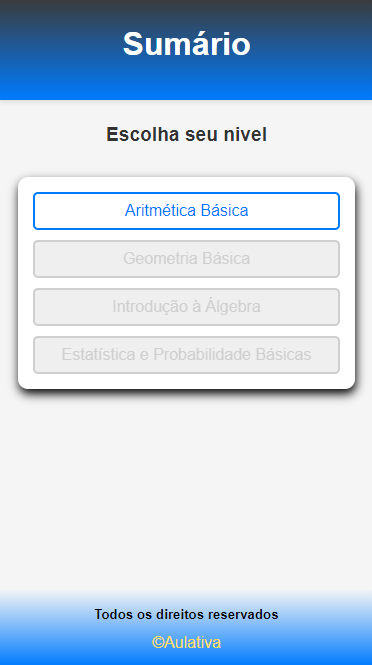
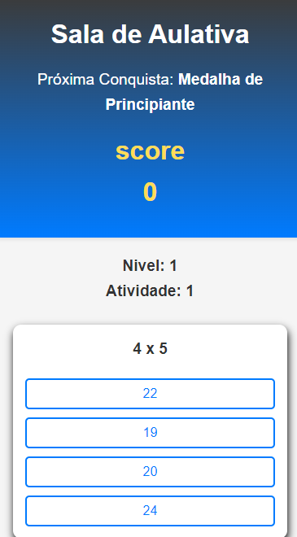

# Sala de Aulativa - Matemática Interativa

## Descrição
Este é um projeto educacional gamificado desenvolvido para ajudar estudantes a praticar e aprimorar suas habilidades em matemática. Ele apresenta uma série de questões, onde o jogador pode selecionar a resposta correta. Conforme o progresso é feito, o jogador sobe de nível e desbloqueia conquistas personalizadas.

## Funcionalidades
- **Níveis progressivos**: À medida que o jogador acerta questões, ele avança para níveis mais desafiadores.
- **Sistema de conquistas**: Conquistas são desbloqueadas ao atingir certos marcos, como completar 10 atividades por nível.
- **Questões aleatórias**: Questões são geradas de forma aleatória, com base no nível do jogador.
- **Interface simples e amigável**: Uma página simples e direta para que os usuários se concentrem no aprendizado.

## Capturas de Tela
### Tela Inicial

### Conquista Desbloqueada

### Tela de Questão

## Tecnologias Utilizadas
- **HTML**: Estrutura básica da página.
- **CSS**: Estilos para a interface do jogo.
- **JavaScript**: Lógica de geração de perguntas e respostas, sistema de níveis, pontuação e conquistas.

## Como Usar
1. **Iniciar o jogo**: Ao carregar a página, o sistema irá gerar uma questão de multiplicação baseada no seu nível atual.
2. **Responder**: Clique em uma das opções de resposta (A, B, C, ou D).
3. **Subir de nível**: A cada 10 questões corretas, o jogador avança um nível, aumentando a dificuldade.
4. **Desbloquear conquistas**: Cada nível tem uma conquista associada, que será exibida no topo da página.
   
## Como Executar Localmente
1. Faça o download ou clone este repositório: